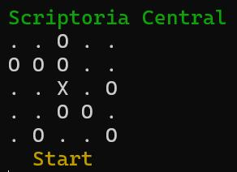
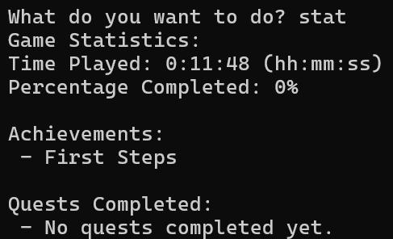
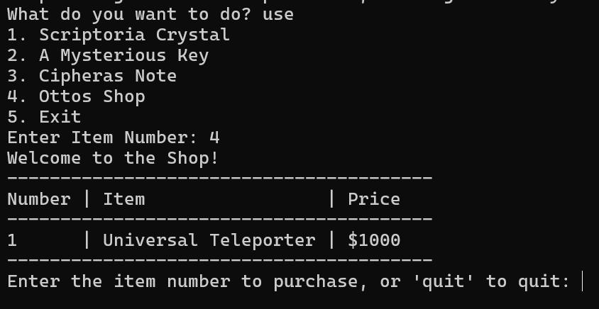
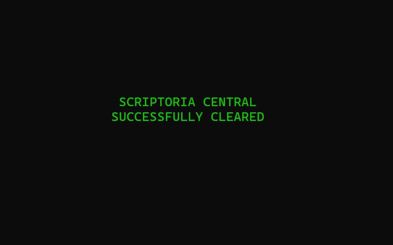
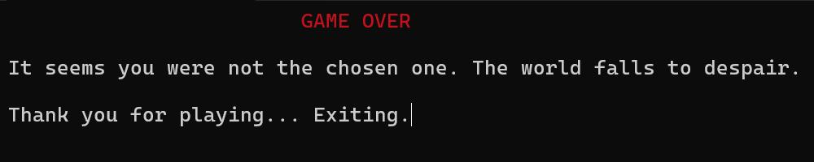

# 🕹️ Code of Eternity

**Code of Eternity** is a Python-based text adventure game where you step into the role of **Byte**, exploring digital realms, solving puzzles, and facing guardians while learning the fundamentals of computer science.
Built with a mix of storytelling, logic, and programming-inspired challenges, it’s designed to be both **fun and educational**.

---

## ✨ Features

* **🌍 Realm Exploration**: Travel through 5 unique realms including *Scriptoria Central*, *Recursive Realm*, *Binary Battlegrounds*, and *Variable Valleys*.
* **⚔️ Guardian Challenges**: Solve puzzles inspired by **logic gates, recursion, riddles, and code deciphering** to progress.
* **🎒 Dynamic Game State**: Track inventory, health, quests, and achievements.
* **🎵 Immersion**: Background music and sound effects (via `pygame`) for an engaging retro feel.
* **📖 Storytelling**: Handcrafted dialogues, puzzles, and lore around computer science concepts.

---

## 🛠️ Installation & Setup

### 1. Clone the repository:

```bash
git clone https://github.com/your-username/code-of-eternity.git
cd code-of-eternity
```

### 2. Install dependencies:

```bash
pip install -r requirements.txt
```

### 3. Run the game:

```bash
python COE.py
```

---

## 📂 Project Structure

```
Code-of-Eternity/
│── README.md               <- This file
│── requirements.txt        <- Python dependencies
│── COE.py                  <- Main game script
│── data.py                 <- Realm/world data
│── unpacker.py             <- Helper scripts
│── /dialogues              <- Dialogue text & scripts
│── /logicgate              <- Logic puzzles
│── /music                  <- Game music & sound effects
│── .gitignore              <- Ignore unnecessary files (cache, saves, binaries)
```

---

## 🎮 Gameplay

* Move around using **commands** (`go north`, `take item`, `use teleporter`).
* Collect items and solve **guardian puzzles** to unlock new realms.
* Teleport using **realm crystals** or the **Universal Teleporter** (once unlocked).
* Defeat the **Four Commandments**, generals of the final villain, to reach the endgame.

---
### Minimap View


### Player Stats


### Item Shop


### Liberation of an Area


### Zero Health (Game Over)


---

## 🚀 Future Improvements

* More replayability with branching storylines.
* Advanced puzzles (dynamic coding challenges).
* Expanded lore and additional realms.

---

## 📚 Skills & Tech Stack

* **Python (Game Logic & Design)**
* **Object-Oriented Thinking**
* **Problem Decomposition**
* **Basic Computer Science Concepts (recursion, logic gates, puzzles)**
* **Git & GitHub (version control, collaboration)**

---

### 🎵 Music Assets

The game’s music has been separated into a **different repository** due to licensing restrictions.

You can access it here: [**Music Repository Link**](https://github.com/TheJazz123/coe-music)

**Instructions:**

1. Clone or download the music repository.
2. Place the music files in the `music/` folder of this game’s directory (create it if it doesn’t exist).
3. The game will automatically detect and play the music during gameplay.

---

## ⚡ Author

👤 **Thejas Bhat**
Electronics & Communication Engineering @ RV College of Engineering
Interests: VLSI, Embedded Systems, Hardware Design, Game Design

---
